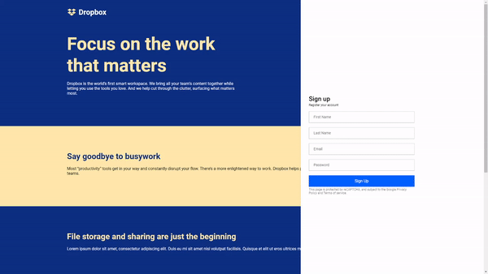

<h1 align="center">
UI Clone - Dropbox Landing Page
</h1>

Responsive Dropbox Landing Page UI clone for study purposes.

Deployed <a href="#">here</a>.

  

  

  

  

## 🔖 Layout

  

## Techs

- [x] React.js
- [x] Styled Components
- [x] TypeScript

## Starting Dev Environment

1. Run `npm install` or `yarn install`. 
2. Run `yarn start` and access `http://localhost:3000`. 

## Contributing

Please read [CONTRIBUTING.md](CONTRIBUTING.md) for details on our code of conduct, and the process for submitting pull requests.
